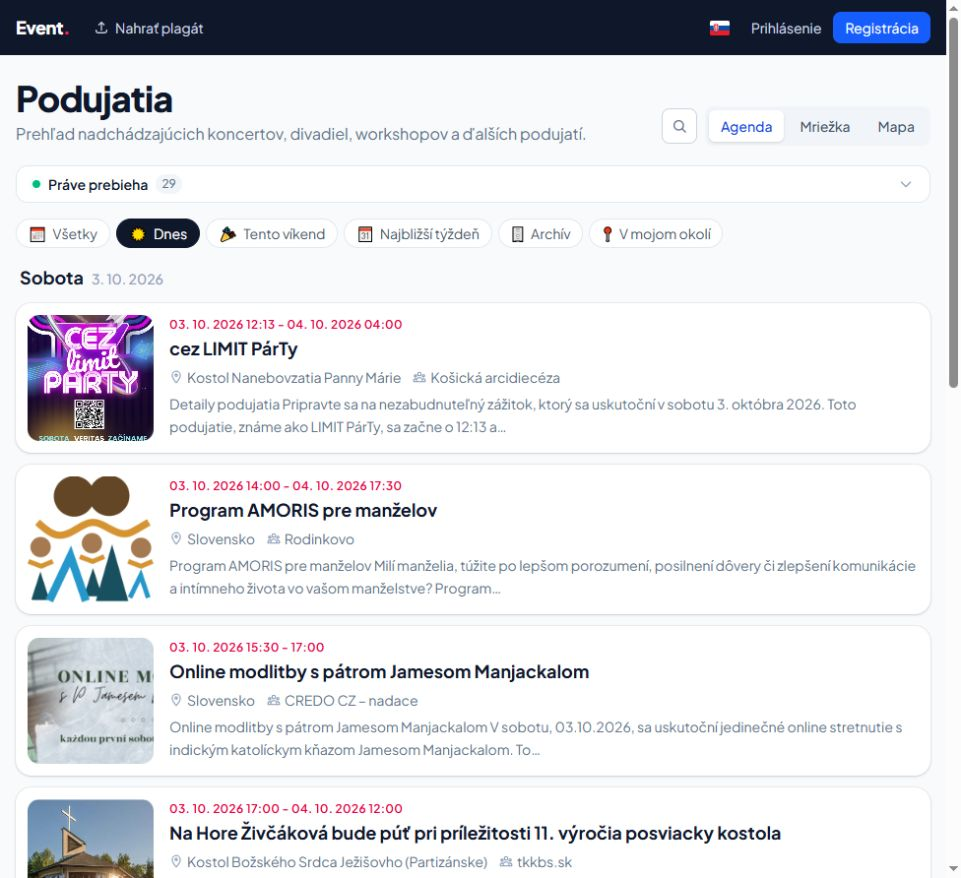

# Kontrola webu — 3. 10. 2026

Testované cez prehliadač na http://localhost:5173/, na bežnej šírke aj pri 390 × 844 px.

## Opravené chyby a vylepšenia

- **Archív zobrazoval nadchádzajúce podujatia.** Prechod z `/akcie` na `/akcie/archiv` menil nadpis, ale nespúšťal nový dotaz. Výpis teraz reaguje aj na zmenu typu zoznamu.
- **„Všetky“ nezrušilo filter „Dnes“.** Na aktuálnej stránke teraz ruší vyhľadávanie, časové aj miestne filtre, obnovuje prvú stranu a resetuje ovládanie polohy.
- **Rýchle časové filtre neprežili obnovenie stránky.** „Dnes“ a „Najbližší týždeň“ sa zapisujú do `?when=today|week` a obnovujú sa z adresy.
- **„Dnes“ zahŕňalo aj zajtrajšiu polnoc.** Verejné okná sa počítajú v Europe/Bratislava a porovnávajú s presnými UTC hranicami uložených termínov. Víkend zohľadňuje aj zmenu letného času; administratívne filtre zadané iba dátumom si zachovávajú svoje správanie.
- **Tlačidlá vyhľadávania reagovali iba na mousedown.** Zrušenie výrazu a ovládanie histórie teraz používajú click, ktorý funguje aj s klávesnicou. Prechod Tabom do histórie ponuku nezatvára.
- **Stránkovanie malo iba symbolické popisy.** Má pomenovanú navigáciu a lokalizované názvy tlačidiel v SK/CS/EN/DE. Počas načítania a pri chybe sa nezobrazuje staré stránkovanie.
- **Údaje ďalších účastníkov v rezervácii nemali popisky.** Mená a e-maily majú teraz viditeľné, prístupné označenie.

## Overenie

- Prehliadač: úvod, vyhľadávanie bez výsledkov, filtre, obnovenie stránky, prechod katalóg/archív, detail podujatia, mapa, mobilné rozloženie a menu, otvorenie rezervácie a zmena počtu vstupeniek, úvod nahrávania plagátu, stránka obchodných podmienok.
- Kompletná frontendová sada po hlavných opravách: **220 testov prešlo**. Po poslednej úprave klávesnice: **21 cielených testov prešlo**, vrátane dvoch nových regresných testov.
- Backend: **17 testov prešlo** (časové hranice, spoločné filtre, mapa a verejné zoznamy).
- Produkčný build vrátane typovej kontroly; aktualizovaný verzovaný `ui/dist`.
- ESLint: bez chýb, 49 existujúcich upozornení. PHP formátovanie prešlo.

## Zostáva overiť alebo doplniť

- **Prihlásená zóna nebola prejdená v prehliadači:** účet z lokálneho seed nastavenia vrátil „Nesprávny e-mail alebo heslo“. Vyžiadané funkčné prihlasovacie údaje. Účet ani jeho práva sa nemenili.
- **Google prihlásenie:** konzola hlási, že aktuálny origin nie je povolený pre nakonfigurované Google client ID. Treba upraviť konfiguráciu príslušného OAuth klienta alebo použiť správny lokálny klient; zmeny v Google konzole neboli vykonané.
- **Obchodné podmienky majú nezaplnené `[DOPLNIŤ: ...]` údaje prevádzkovateľa.** Dopĺňanie vyžaduje skutočné firemné údaje.
- Rezervácie sa neodosielali a AI analýza plagátu sa nespúšťala. Ich konečné uloženie, e-maily a spracovanie súborov týmto auditom nie sú overené.

Predchádzajúca lokálna úprava `AdminIndexPage.vue` bola zachovaná. Audit nebol commitnutý ani nasadený.

Prihlásená zóna bola následne overená. Výsledky a opravy: [audit prihlásenej zóny](web-audit-auth-2026-10-03.md).
