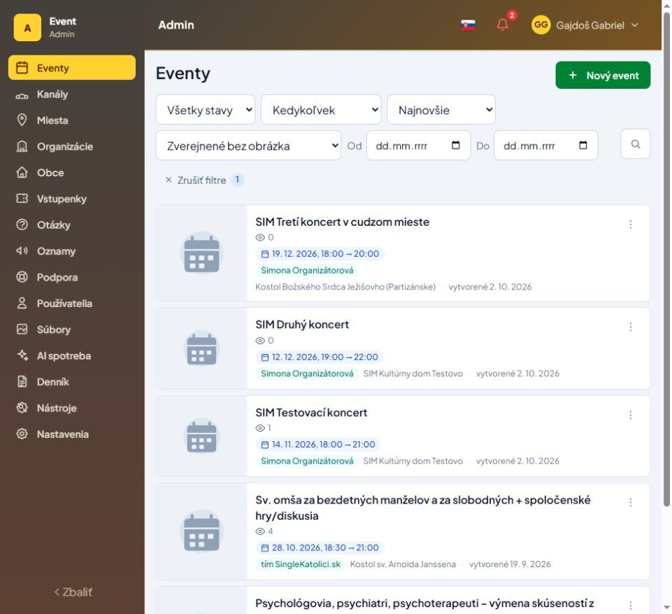
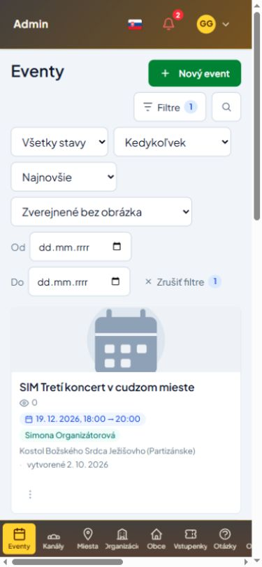
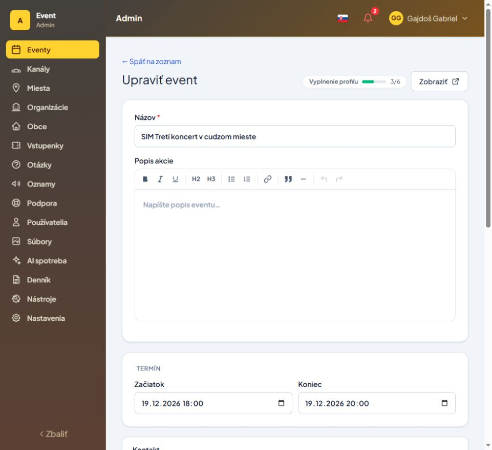

# Kontrola prihlásenej zóny — 3. 10. 2026

Testované cez prehliadač na localhost:5173 v existujúcej relácii superadministrátora, v administrácii aj organizátorskom dashboarde.

## Opravy

- Odkazy zo sekcie „Vyžaduje pozornosť“ otvárali širší zoznam než príslušný počet. Štyri skupiny podujatí teraz používajú spoločné pravidlá pre počítanie aj výpis: staré koncepty, koncepty po začiatku termínu, aktívne publikované bez hlavného obrázka a najbližšie podujatia s aktívnymi lístkami bez účastníkov. Pribudol viditeľný filter v SK/CS/EN/DE. V prehliadači overené: 5 podujatí bez obrázka, zhodne s prehľadom.
- Klik na „Eventy“ v bočnom menu odstránil filtre iba z adresy. Zoznam teraz reaguje aj pri opätovnom použití stránky, vrátane návratu na prvú stranu. Zrušenie filtrov v prázdnom výsledku odstráni aj doplnkové filtre.
- Detail cudzieho kanála v administrácii ponúkal lístky, otázky, check-in a sériu cez organizátorské endpointy, ktoré prístup odmietali. Ovládanie teraz vychádza z členstva v kanáli. Administratívne zobrazenie záznamu zostalo zachované; organizátorský rozsah sa nerozšíril.
- Načítanie termínov série mohlo skončiť neošetrenou chybou. Teraz má chybu s opakovaním, blokuje pridávanie počas načítania a chyby a ignoruje oneskorenú odpoveď predchádzajúceho podujatia.
- Výberové filtre majú prístupné názvy stavu, termínu a zoradenia.

## Overené

- Dashboard, zoznam podujatí a validácia prázdneho formulára nového podujatia.
- Všetky hlavné sekcie administrácie: prehľad, podujatia a detail, kanály, miesta, organizácie, obce, vstupenky, otázky, oznamy, podpora, používatelia, súbory, AI spotreba, denník, nástroje a nastavenia.
- Správy organizátora a vlastné podujatie: nastavenie lístkov, prihlásení, check-in a otázky. Prázdne stavy sa načítali správne.
- Mobil 390 × 844 px: rozbalenie filtrov, aktívny filter a zoznam. Obnovenie stránky zachovalo prihlásenie aj filter. Šírka prehliadača bola obnovená.
- Celá frontendová sada po oprave navigácie: 224 testov prešlo. Po následnom doplnení správy termínov: 12 cielených testov prešlo, vrátane nového testu obnovy po chybe.
- Záverečná backendová sada: 33 testov, 176 assertions. Zahŕňa filtre, detail, štatistiky, prihlásenie, obmedzenie chybných pokusov a pravidlá prístupu.
- Produkčný build a typová kontrola prešli; aktualizovaný ui/dist. Cielený ESLint bez chýb. PHP formátovanie prešlo. Build uvádza existujúce upozornenie na veľkosť hlavného balíka.

## Rozsah a obmedzenia

Ide o funkčnú kontrolu s cielenými testami prístupových pravidiel, nie kompletný penetračný audit všetkých rolí. Správa lístkov cudzieho kanála priamo z administrácie zatiaľ nemá samostatnú cestu; nefunkčné odkazy do organizátorskej časti sa už nezobrazujú.

Neodosielali sa správy, pozvánky ani e-maily, nezakladali rezervácie, nemenili členstvá ani heslo, nespúšťali importy ani platené AI operácie. Skutočné skenovanie QR a platby neboli overené. Denník obsahuje historické chyby dopĺňania profilov; príčina týchto úloh nebola súčasťou kontroly obrazoviek.

Predchádzajúca úprava AdminIndexPage.vue bola zachovaná. Zmeny neboli commitnuté ani nasadené.

## Ďalšia kontrola detailov a formulárov

- Potvrdená chyba navigácie: z detailu SIM Testovací koncert (11064) viedol odkaz na SIM Druhý koncert (11066), adresa sa zmenila, ale obsah zostal z pôvodného podujatia. Oprava v oboch prihlásených layoutoch načíta čerstvú stránku pri zmene cesty. To chráni aj formuláre, ktoré si pri otvorení zapamätajú ID záznamu. Zmena query na rovnakej ceste stránku znovu nevytvára a zachová rozpracované hodnoty.
- V prehliadači overený prechod 11064 → 11066 → 11067: správny názov, termín, miesto, verejný odkaz a odkaz na úpravu. Formulár 11067/edit zobrazuje údaje správneho záznamu.
- Textový editor získal rolu viacriadkového textového poľa a názov „Popis akcie“. Tlačidlá lišty majú vlastné názvy; „Tučné“ už nepreberá celý text obklopujúcej popisky. Overené v prístupnom strome po obnovení stránky.
- 21 cielených testov prešlo: navigácia oboch layoutov, tvorba/úprava podujatí a filtre zoznamu. Produkčný build a typová kontrola prešli; ui/dist bol opäť aktualizovaný. Cielený lint bez chýb, v AdminLayout zostalo existujúce upozornenie na nepoužitú premennú auth.
- Počas kontroly sa údaje podujatí neukladali.

### Záverečné overenie tejto kontroly

- Celá frontendová sada prešla: **227 testov v 40 súboroch** (`npm run test -- --maxWorkers=2`).
- Prvý beh súbežne s buildom skončil na časových limitoch štyroch testov navigácie. Samostatné opakovanie všetkých šiestich testov navigácie aj následný kompletný beh s dvoma pracovníkmi prešli bez zmeny časových limitov alebo testov.
- Finálny produkčný build a typová kontrola prešli. Cielený lint nemá chyby; HtmlEditor má existujúce upozornenie na chýbajúcu predvolenú hodnotu vlastnosti title v ToolBtn.
